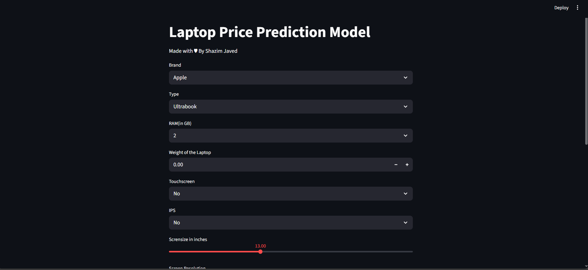

💻 Laptop Price Prediction App

A Streamlit web app that predicts laptop prices based on Data Trainings using a Random Forest machine learning Algorithm with ~88% Accuracy.

## 📸 Demo
Here’s a quick look at the app in action:

📂 Project Files

app.py – Streamlit UI and inference code

pipe.pkl – Serialized ML pipeline for predictions

df.pkl – Serialized dataset metadata for dropdowns

laptop_price_model.ipynb – Jupyter Notebook (model training & preprocessing)

laptop_data.csv, cleaned_laptop_data.csv – Dataset files used during modeling

🚀 Quickstart (Windows)
1. Create and activate a virtual environment
python -m venv .venv
.\.venv\Scripts\Activate.ps1

If activation is blocked in PowerShell:

Set-ExecutionPolicy -Scope Process -ExecutionPolicy Bypass
.\.venv\Scripts\Activate.ps1

2. Install dependencies
pip install -r requirements.txt

3. Run the app
streamlit run app.py

Open the URL shown in the terminal (usually http://localhost:8501).

🎯 Usage

Select laptop attributes (brand, type, RAM, storage, display, etc.).

Click “Predict Price” to see the estimated laptop price.

👉 A signature line is displayed at the bottom of the UI:
“Made with ♥ by Shazim Javed”

⚡ Troubleshooting

Port already in use:

streamlit run app.py --server.port 8502

PowerShell rendering errors (PSReadLine):
Run via Command Prompt (cmd) or bypass execution policy as shown above.

📓 Optional: Jupyter kernel setup

To use this project’s virtual environment in Jupyter Notebook:

pip install ipykernel
python -m ipykernel install --user --name Project_4 --display-name Project_4

Then select Project_4 as the kernel in laptop_price_model.ipynb.

🛠️ Tech Stack

Python (Pandas, NumPy, Scikit-Learn)

Streamlit (Web app UI)

Pickle (Model serialization)

📜 License

This project is made for Educational/Learning Purpose only
.

✨ Made with ♥ by Shazim Javed
